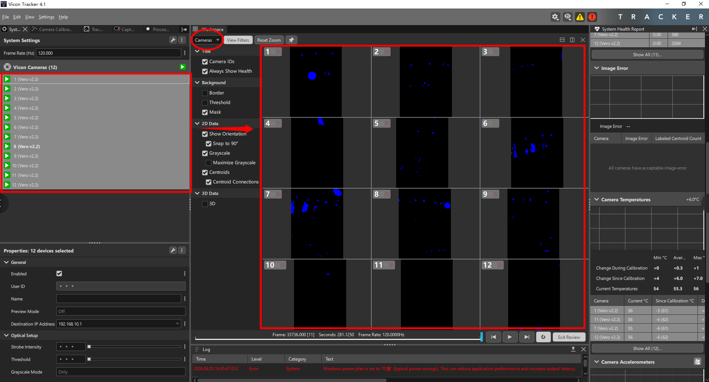
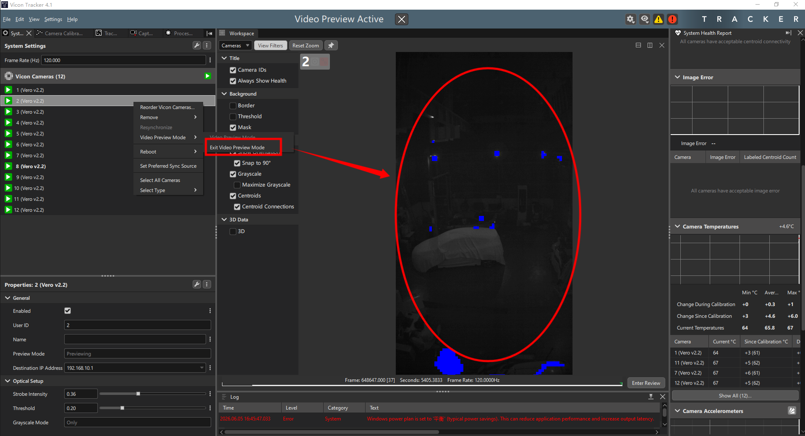
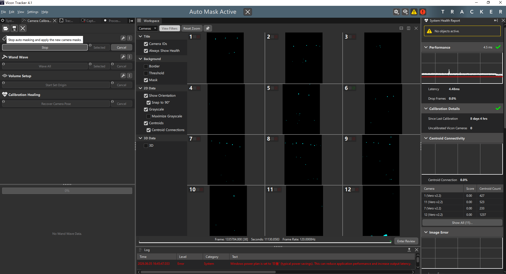
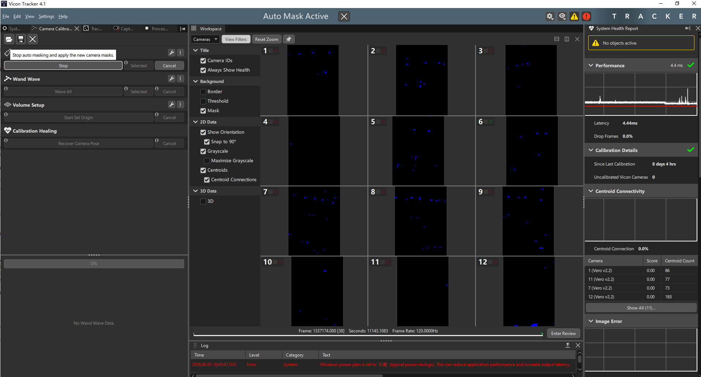
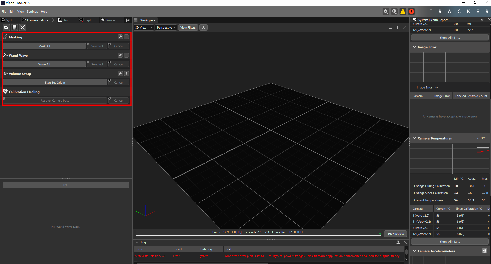
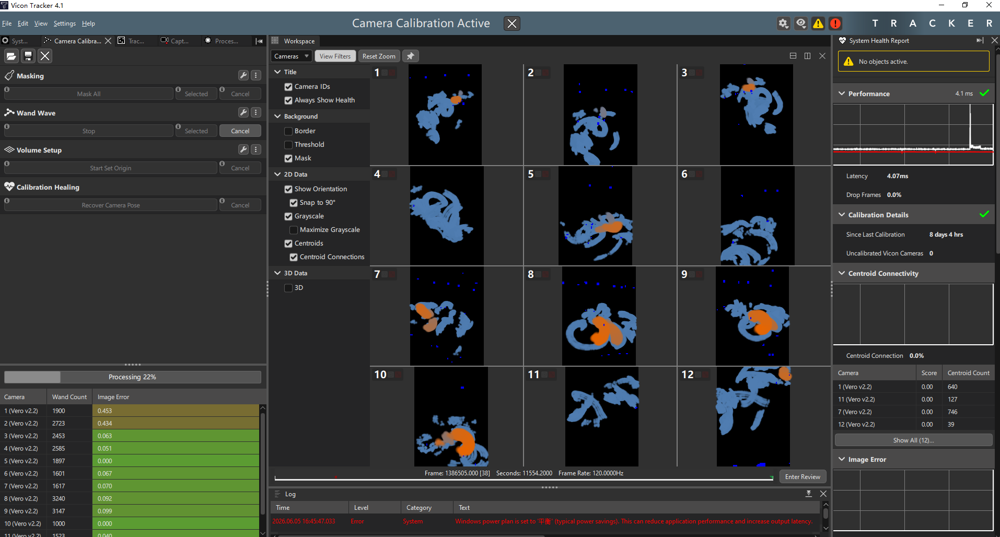
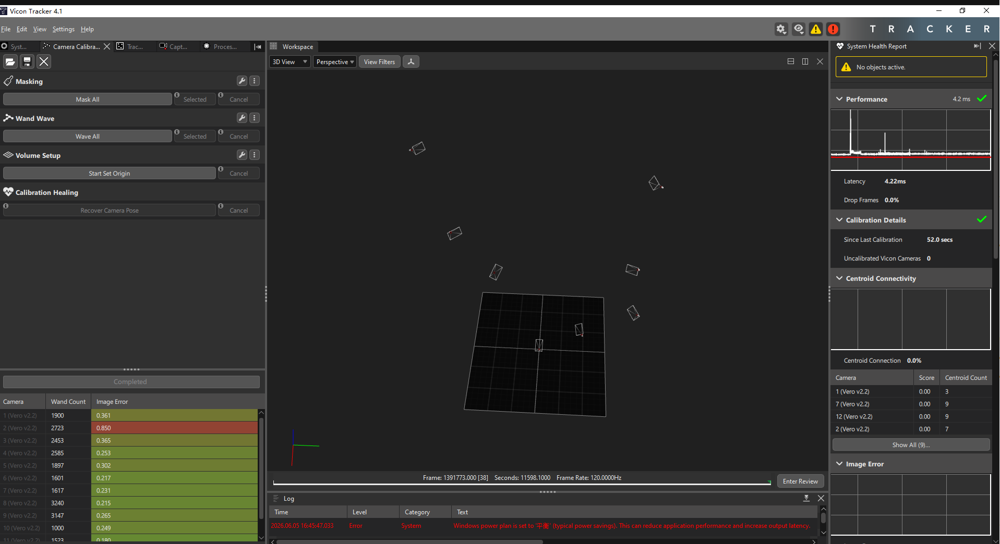
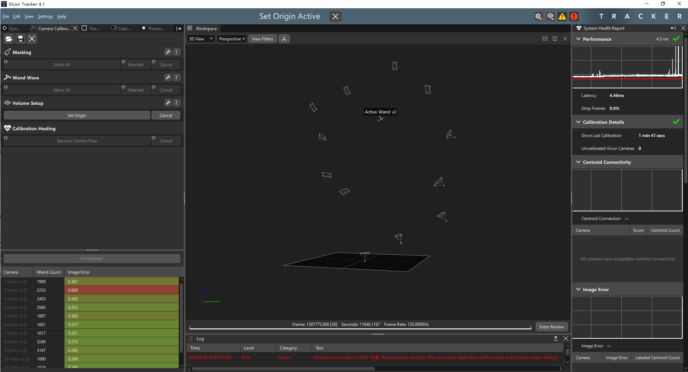
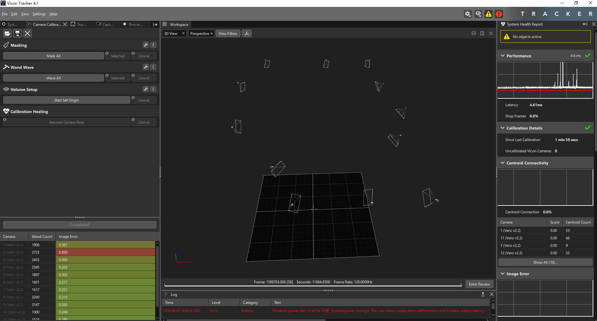
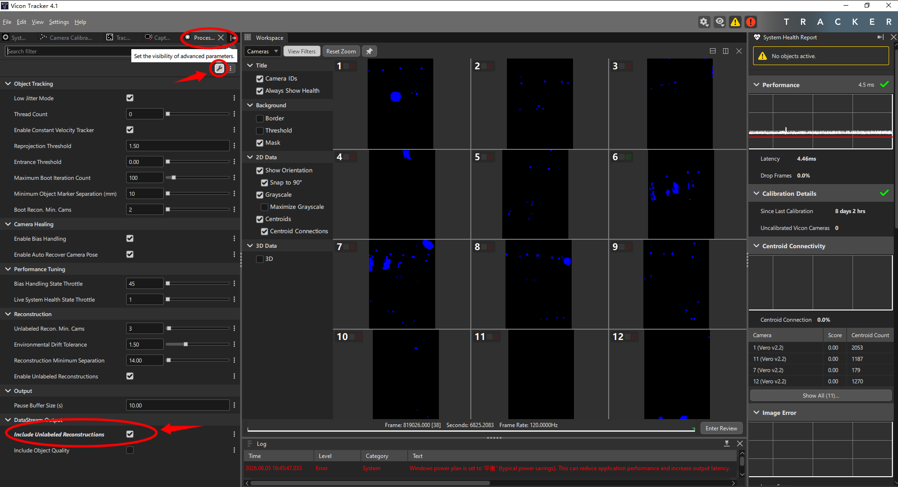

# Part 0 — Prerequisites and Setup

This part covers everything you need installed and configured before starting the example projects. Follow each section in order — later sections depend on earlier ones.

> **Please do use AI while going through this tutorial!** Some parts of this tutorial, like the viewer in example 4, include helper functions and overcomplicated settings just for style and completeness and are unrelated to core usage of ROS2 and Crazyflie. Going through the visualization and state machine function pieces can be **Tedious** and unnecessary. Therefore usage of AI to just get the hang of it and focusing on the important parts is strongly advised!

---

## Section 1: Environment Prerequisites

### 1(a) — Installing Ubuntu 22.04 and ROS2 Humble

#### References

The official ROS2 Humble installation guide is the authoritative reference for this section:

- [ROS2 Humble Installation Guide](https://docs.ros.org/en/humble/Installation/Ubuntu-Install-Debs.html)

An alternative automated installer (useful if GPG or repository issues are encountered):

- [fishros one-line installer](https://fishros.org.cn/forum/topic/20/%E5%B0%8F%E9%B1%BC%E7%9A%84%E4%B8%80%E9%94%AE%E5%AE%89%E8%A3%85%E7%B3%BB%E5%88%97?lang=en-US)

#### System Requirements

- **Ubuntu 22.04 LTS (Jammy Jellyfish), 64-bit** — required for ROS2 Humble binary packages
- **Dual-boot or bare-metal install strongly recommended**

> **Warning! Avoid using a virtual machine (VM).** VMs introduce issues that are hard to diagnose and not covered by this tutorial: graphics card passthrough problems break RViz2 and vispy rendering; network adapter configuration makes Vicon streaming unreliable; USB passthrough for the Crazyradio is inconsistent; and the additional performance overhead can cause timing problems with the 30Hz control loops used in later examples. If you absolutely must use a VM, set the network adapter to "Bridged" mode and expect to debug issues on your own.

- Minimum: 4GB RAM, 25GB free disk (building the firmware and multiple ROS2 workspaces consumes significant space)
- If you already have Ubuntu 22.04 installed, skip the OS install step below

#### Installation

**Set Up a UTF-8 Locale**

ROS2 requires a UTF-8-capable locale. On a standard Ubuntu 22.04 desktop install the locale is already configured, but minimal or non-English installs may ship without it. A missing UTF-8 locale causes cryptic encoding errors in `rosdep`, `colcon`, and ROS2 command-line tools.

Check the current locale:

```bash
locale
```

If `LANG` does not show a UTF-8 value (e.g., it shows `POSIX` or `C`), generate and set the `en_US.UTF-8` locale:

```bash
sudo apt update && sudo apt install locales
sudo locale-gen en_US en_US.UTF-8
sudo update-locale LC_ALL=en_US.UTF-8 LANG=en_US.UTF-8
export LANG=en_US.UTF-8
```

> `en_US.UTF-8` is the locale tested by the ROS2 team. Any UTF-8 locale works in principle, but `en_US.UTF-8` is the safest choice. The `export LANG` line sets the locale for the current terminal — the `update-locale` command makes it permanent for future terminals.

**Platform Prerequisites**

Before installing ROS2, make sure the base system is ready. Open a terminal and run:

```bash
sudo apt update
sudo apt install curl gnupg2 lsb-release software-properties-common
```

These packages are needed for adding the ROS2 repository (`curl`, `gnupg2`), detecting the Ubuntu version (`lsb-release`), and managing apt repositories (`software-properties-common`). On a fresh Ubuntu 22.04 desktop install they are usually already present, but we install them explicitly to be safe.

**Ubuntu 22.04 (if not already installed)**

If you do not yet have Ubuntu 22.04:

1. Download the ISO from the [official Ubuntu releases page](https://releases.ubuntu.com/22.04/)
2. Create a bootable USB with Rufus (Windows) or Startup Disk Creator (Ubuntu)
3. Install as dual-boot or on a dedicated machine

A full Ubuntu install guide is outside the scope of this tutorial — refer to the [official Ubuntu installation tutorial](https://ubuntu.com/tutorials/install-ubuntu-desktop).

**ROS2 Humble Desktop-Full**

The official install path has three logical steps: enable Universe, add the ROS2 repository, and install the packages. The commands below use the manual GPG-key method, which is well-tested and works reliably. For reference, the [official binary install guide](https://docs.ros.org/en/humble/Installation/Ubuntu-Install-Debs.html) now uses a newer `ros2-apt-source` .deb package to configure the repository — both methods produce the same result.

Step 1 — Enable the Ubuntu Universe repository:

```bash
sudo apt update
sudo add-apt-repository universe
sudo apt update
```

Step 2 — Add the ROS2 GPG key and apt repository:

```bash
sudo curl -sSL https://raw.githubusercontent.com/ros/rosdistro/master/ros.key \
    -o /usr/share/keyrings/ros-archive-keyring.gpg

echo "deb [arch=$(dpkg --print-architecture) signed-by=/usr/share/keyrings/ros-archive-keyring.gpg] http://packages.ros.org/ros2/ubuntu $(. /etc/os-release && echo $UBUNTU_CODENAME) main" \
    | sudo tee /etc/apt/sources.list.d/ros2.list > /dev/null

sudo apt update
```

Step 3 — Install ROS2 Humble (desktop-full):

```bash
sudo apt install ros-humble-desktop-full
```

This installs the complete ROS2 Humble distribution: core libraries (`rclcpp`, `rclpy`), development tools, RViz2, demo nodes, and tutorials. We need the `desktop-full` variant specifically — the smaller `ros-base` variant does not include RViz2 or the demo nodes used for verification.

Alternative: fishros automated installer

If the manual steps above fail (e.g., network issues with the ROS GPG server), the `fishros` tool automates the entire process:

```bash
wget http://fishros.com/install -O fishros && bash fishros
```

Follow the prompts, selecting ROS2 Humble and the desktop-full installation option. The tool handles locale setup, repository configuration, and package installation automatically.

**Set Up the ROS2 Environment**

ROS2 needs to be sourced in every terminal that will use ROS2 commands. To avoid doing this manually each time, add it to your shell startup file:

```bash
echo "source /opt/ros/humble/setup.bash" >> ~/.bashrc
```

> If you use `zsh`, replace `~/.bashrc` with `~/.zshrc`.

Open a new terminal (or run `source ~/.bashrc`) for this to take effect. Later, when we set up the tutorial workspace, a second source line will be added for `tutorial_ws/install/setup.bash`. For now, just the ROS2 line.

**Install Python and Build Tools**

These are required for building ROS2 packages and installing Python dependencies throughout the examples:

```bash
sudo apt install python3-pip python3-colcon-common-extensions python3-rosdep
```

- `python3-pip` — Python package installer (used for cflib, vispy, numpy, etc.)
- `python3-colcon-common-extensions` — `colcon build` tool for building ROS2 workspaces
- `python3-rosdep` — dependency resolver for ROS2 packages

Initialize rosdep (one-time setup):

```bash
sudo rosdep init
rosdep update
```

> If `sudo rosdep init` prints "already initialized", a previous ROS install already completed this — no action needed.

**System Python Hygiene**

> **Warning!** If you have Anaconda or Miniconda installed, conda's Python will shadow the system Python. ROS2 packages will fail to import with cryptic `ModuleNotFoundError` messages. This was one of the most frequent issues encountered during the development of these examples.

Check which Python your terminal is using:

```bash
which python3
# Must show: /usr/bin/python3
# If it shows .../anaconda3/... or .../miniconda3/..., conda is active
```

If conda is active:

```bash
conda deactivate
```

If conda auto-activates on every terminal open, disable that behavior permanently:

```bash
conda config --set auto_activate_base false
```

Then restart your terminal.

> Whenever you install Python packages for this tutorial, use the system Python explicitly:
> ```bash
> python3 -m pip install --user <package>
> ```
> Running bare `pip install` may target conda's pip instead of the system pip, silently installing packages where ROS2 cannot find them. You can verify which pip is active with `pip3 -V` — the path should be under `/usr/`.

#### Verification

Open two terminals side by side. In the first:

```bash
ros2 run demo_nodes_cpp talker
```

Expected output: messages counting up every second.

In the second:

```bash
ros2 run demo_nodes_py listener
```

Expected output: the listener prints the messages sent by the talker.

If both work, ROS2 is correctly installed. Kill both with Ctrl+C.

#### Potential Issues

These are problems that were actually encountered during the initial setup and development of these examples. If one occurs, check the corresponding fix.

- **`ros2: command not found`** — ROS2 setup was not sourced in this terminal. Run `source /opt/ros/humble/setup.bash`, or open a new terminal if you added it to `.bashrc`.
- **`rosdep`, `colcon`, or ROS2 tools print garbled characters or Unicode/encoding errors** — the system locale is not set to UTF-8 (common on minimal or non-English Ubuntu installs). Check with `locale` — if `LANG` is not a UTF-8 value, run the locale setup step above: `sudo apt install locales && sudo locale-gen en_US en_US.UTF-8 && sudo update-locale LC_ALL=en_US.UTF-8 LANG=en_US.UTF-8`. Then restart the terminal.
- **`ros2: command not found` in a new terminal** — `.bashrc` has not been reloaded since you added the source line. Run `source ~/.bashrc` or open a fresh terminal.
- **`package 'demo_nodes_cpp' not found`** — you installed `ros-humble-ros-base` instead of `desktop-full`. Install the correct variant: `sudo apt install ros-humble-desktop-full`.
- **ROS2 nodes fail with `ModuleNotFoundError`** — conda is active and shadowing the system Python. Run `conda deactivate` and verify with `which python3` that it returns `/usr/bin/python3`.
- **`pip install` succeeds but ROS2 can't find the package** — pip installed to the wrong Python (likely conda's). Always use `python3 -m pip install --user <package>` and verify the active pip with `pip3 -V`.
- **`curl: command not found` during the GPG key step** — `curl` is not installed on your system. Run `sudo apt install curl`.
- **GPG key download fails with a network error** — your firewall or proxy may be blocking `raw.githubusercontent.com`. Try the fishros alternative installer, or configure your proxy settings.
- **`lsb-release: command not found`** — your Ubuntu install is minimal and missing this package. Run `sudo apt install lsb-release`.
- **`add-apt-repository: command not found`** — `software-properties-common` is not installed. Run `sudo apt install software-properties-common`.
- **RViz2 shows a blank or black window (later in the tutorial)** — you are likely running in a VM without GPU passthrough. This is one of the reasons VMs are advised against. Switch to a bare-metal install.
- **`conda deactivate` does nothing, or `conda` is not found** — conda was never installed on your system. This is fine. If `which python3` already shows `/usr/bin/python3`, you have nothing to worry about.

#### Verification Checklist

After completing this section, confirm all of the following:

- [ ] `ros2 run demo_nodes_cpp talker` and `ros2 run demo_nodes_py listener` work in separate terminals
- [ ] `which python3` returns `/usr/bin/python3`
- [ ] conda is either deactivated or auto-activate is disabled
- [ ] `source /opt/ros/humble/setup.bash` is in `.bashrc` (or `.zshrc`)
- [ ] `colcon --help` prints usage information
- [ ] `pip3 -V` points to a path under `/usr/`

---

### 1(b) — Pulling and Building the Codebase

#### References

The four repositories we pull in this section and their official sources:

- [Crazyswarm2](https://github.com/IMRCLab/crazyswarm2) — ROS2 stack for Crazyflie control, simulation, and mocap integration
- [crazyflie-lib-python (cflib)](https://github.com/bitcraze/crazyflie-lib-python) — Python CRTP communication library, the foundation for all Crazyflie control
- [crazyflie-clients-python (cfclient)](https://github.com/bitcraze/crazyflie-clients-python) — Qt GUI client for flashing firmware and configuring drones
- [crazyflie-firmware](https://github.com/bitcraze/crazyflie-firmware) — Onboard C firmware for the Crazyflie; also provides the Python bindings (`cffirmware`) used by the Crazyswarm2 simulator
- [motion_capture_tracking](https://index.ros.org/p/motion_capture_tracking/) — ROS2 package for streaming mocap data (Vicon, Optitrack, Qualisys) to Crazyswarm2

#### Overview

This section clones and builds the four core repositories plus one apt package that the entire tutorial depends on. The recommended directory layout puts everything under a single folder so paths are consistent and easy to reference in later examples.

By the end of this section, these are available:
- `cflib` installed and importable in Python
- `cfclient` installed and launchable from the terminal
- `crazyswarm2` built and sourceable as a ROS2 workspace
- `crazyflie-firmware` built with its Python bindings available for the simulator
- `motion_capture_tracking` installed as a system ROS2 package
- All Python dependencies (`numpy`, `pyyaml`, `vispy`, `rowan`, `PyQt`) installed

#### Directory Structure (target state)

```
$CRAZYFLIE_TUTORIAL/
├── crazyswarm2_repo/              # colcon workspace root
│   ├── build/
│   ├── install/
│   └── src/
│       └── crazyswarm2/           # Cloned CS2 repository
│           ├── crazyflie/         # CS2 server + launch + configs
│           ├── crazyflie_py/      # Python API
│           ├── crazyflie_interfaces/  # ROS2 .msg and .srv definitions
│           ├── crazyflie_sim/     # Simulation backend
│           └── crazyflie_examples/
├── crazyflie-lib-python/          # cflib (pip install -e .)
├── crazyflie-clients-python/      # cfclient (pip install -e .)
├── crazyflie-firmware/            # bindings built (make bindings_python), build/cffirmware* available
└── tutorial_ws/                   # Created later, in the examples
```

#### Step 1: Create the Tutorial Root and Install Python Dependencies

Before cloning anything, set the tutorial root location and install the Python packages that are needed globally across all examples. This avoids repeated installs later.

```bash
export CRAZYFLIE_TUTORIAL=~/crazyflie_tutorial #change this location to you tutorial folder
echo "export CRAZYFLIE_TUTORIAL=$CRAZYFLIE_TUTORIAL" >> ~/.bashrc
mkdir -p $CRAZYFLIE_TUTORIAL
cd $CRAZYFLIE_TUTORIAL
```

> The variable `$CRAZYFLIE_TUTORIAL` is used throughout this tutorial for all paths. You can place the tutorial folder anywhere — just change the path in the `export` line above (e.g., `export CRAZYFLIE_TUTORIAL=/home/me/my_tutorial`). All subsequent commands reference `$CRAZYFLIE_TUTORIAL` and will work regardless of where you put it.

Ubuntu 22.04 ships pip 22.0.2 and setuptools 59.x via apt — both too old for the editable installs used in Steps 2–3. Upgrade both:

```bash
python3 -m pip install --user --upgrade pip
python3 -m pip install --user "setuptools>=64,<80"
```

> **Why upgrade pip?** pip 22.0.2 has a bug with PEP 660 build isolation — `pip install -e .` fails with "missing the 'build_editable' hook" even when a compatible setuptools is installed. pip 24.0+ handles this correctly.
>
> **Why `setuptools>=64,<80`?** setuptools 59.x is too old for PEP 660 editable installs (requires ≥64). However, colcon-core (ROS2 Humble's build tool) caps setuptools at <80. The `>=64,<80` pin satisfies both constraints.

Now install the core Python dependencies using the system Python (make sure conda is deactivated first):

```bash
python3 -m pip install --user "numpy~=2.2" pyyaml vispy rowan
```

> **Why `numpy~=2.2`?** cflib (the Crazyflie communication library installed in Step 2) declares `numpy~=2.2` in its own `pyproject.toml` — it requires NumPy 2.x. Installing an older numpy creates a dependency conflict: cflib and cfclient will refuse to work with numpy 1.x. The `numpy~=2.2` constraint matches cflib's requirement and ensures compatibility across all Python dependencies in the tutorial. (Earlier versions of this tutorial used `numpy<2` for compatibility with ROS2 Humble's system numpy 1.x, but cflib has since been updated to require numpy 2.x.)

- `numpy` — numerical arrays, used everywhere (trajectory math, marker positions, vispy vertex data)
- `pyyaml` — YAML config file parsing (crazyflies.yaml, flight configs)
- `vispy` — OpenGL 3D visualization library (used by the custom drone viewer in Examples 4-6)
- `rowan` — quaternion math library (used by Crazyswarm2 internally for orientation conversion)

Install the Qt backend for vispy (vispy needs either PyQt6 or PyQt5 to open a window):

```bash
sudo apt install python3-pyqt6
```

> If `python3-pyqt6` is not available on your system, `python3-pyqt5` works as an alternative. vispy auto-detects whichever is installed.

#### Step 2: Install cflib (crazyflie-lib-python)

cflib is the Python library that communicates with Crazyflie drones over the Crazyradio. Crazyswarm2 depends on it when using the `cflib` backend.

Clone and install in editable mode:

```bash
cd $CRAZYFLIE_TUTORIAL
git clone https://github.com/bitcraze/crazyflie-lib-python.git
cd crazyflie-lib-python
python3 -m pip install --user -e .
```

> `-e` (editable mode) means changes to the cloned source take effect immediately without reinstalling. This is useful if you ever need to debug or patch cflib.

Verify the install:

```bash
python3 -c "import cflib; print('cflib version:', cflib.__version__)"
```

If this prints a version number without errors, cflib is correctly installed.

> **Note:** cflib must be installed BEFORE building Crazyswarm2. The Crazyswarm2 build process checks for cflib and configures the `cflib` backend accordingly. If you build CS2 first and install cflib later, the cflib backend may not work — you would need to rebuild CS2.

#### Step 3: Install cfclient (crazyflie-clients-python)

cfclient is the Bitcraze GUI tool used for flashing firmware, configuring drone parameters, and monitoring telemetry. We use it in Sections 1(c) and 1(d) for Crazyradio setup and drone firmware flashing.

Clone and install:

```bash
cd $CRAZYFLIE_TUTORIAL
git clone https://github.com/bitcraze/crazyflie-clients-python.git
cd crazyflie-clients-python
python3 -m pip install --user -e .
```

Verify:

```bash
cfclient --help
```

This should print the cfclient usage help. The GUI itself (`cfclient` with no arguments) requires a Crazyradio plugged in to do anything useful — we will test that in Section 1(c).

#### Step 4: Clone and Build Crazyswarm2

Crazyswarm2 is a collection of ROS2 packages. The standard approach places the cloned repository inside a colcon workspace's `src/` directory and builds from the workspace root.

**4.1: Clone the repository**

```bash
cd $CRAZYFLIE_TUTORIAL
mkdir -p crazyswarm2_repo/src
cd crazyswarm2_repo/src
git clone --recursive https://github.com/IMRCLab/crazyswarm2
```

This creates a standard colcon workspace: `crazyswarm2_repo/` is the workspace root, and the source code lives at `src/crazyswarm2/`. The `--recursive` flag pulls git submodules (including `crazyflie-link-cpp`) that Crazyswarm2 requires for building. All build and source commands are run from the workspace root (`crazyswarm2_repo/`).

**4.2: Install ROS2 dependencies**

Before building, use `rosdep` to install any system dependencies declared by the CS2 packages:

```bash
cd $CRAZYFLIE_TUTORIAL/crazyswarm2_repo
rosdep install --from-paths src --ignore-src -r -y
```

This reads the `package.xml` files under `src/crazyswarm2/` and installs any missing apt packages. On a fresh ROS2 Humble install, this usually installs a few additional `ros-humble-*` packages.

> **Why `rosdep` here + `apt install motion_capture_tracking` later?** The `crazyflie` package has a hard build dependency on `motion_capture_tracking_interfaces` (declared in `package.xml` and enforced by `find_package(... REQUIRED)` in `CMakeLists.txt` — the package will not build without it, regardless of which backend is used at runtime). `rosdep install` resolves this via the rosdistro mapping and installs `ros-humble-motion-capture-tracking-interfaces` from apt, satisfying the build requirement. The separate `sudo apt install ros-humble-motion-capture-tracking` in Step 6 installs the full package including the `motion_capture_tracking_node` executable — the runtime node used in all hardware examples. Both are needed, and the ordering (rosdep → build → apt install node) is correct because the node is only required at runtime, not at build time.

**4.3: Build the workspace**

```bash
colcon build --symlink-install
```

> `--symlink-install` creates symlinks to the source Python files instead of copying them. This means you can edit a script and run it immediately without rebuilding — essential for the iterative development style used in all the examples.

The build compiles the C++ `crazyflie_server` node (used with the `cpp` backend) and registers the Python packages. Expect this to take a few minutes on the first build.

**4.4: Source the workspace**

```bash
source install/setup.bash
```

Add this to `.bashrc` so every new terminal automatically has access to the CS2 packages:

```bash
echo 'source $CRAZYFLIE_TUTORIAL/crazyswarm2_repo/install/setup.bash' >> ~/.bashrc
```

> The source order in `.bashrc` matters: ROS2 must come first, then workspaces. The order should be:
> ```bash
> source /opt/ros/humble/setup.bash
> source $CRAZYFLIE_TUTORIAL/crazyswarm2_repo/install/setup.bash
> ```

Verify the build worked:

```bash
ros2 pkg list | grep crazyflie
```

Expected output lists at least: `crazyflie`, `crazyflie_py`, `crazyflie_interfaces`, `crazyflie_sim`, `crazyflie_examples`.

#### Step 5: Clone and Build crazyflie-firmware (Python Bindings)

The Crazyflie firmware repository provides two things for this tutorial:
1. Python bindings (`cffirmware`) used by the Crazyswarm2 simulator backend — the simulator runs the exact same PID/Mellinger controller and EKF code as the real drone, compiled for the host CPU
2. The actual C firmware that runs on the physical drone (flashed later in Section 1(d) via cfclient's built-in bootloader, which uses pre-compiled firmware — no local ARM build needed)

This step builds the Python bindings (item 1). The on-drone firmware (item 2) is flashed separately via cfclient.

**5.1: Install build dependencies**

The bindings are generated with SWIG (Simplified Wrapper and Interface Generator) and compiled with a standard host C compiler. Install the required tools:

```bash
sudo apt install swig build-essential python3-dev
```

- `swig` — generates Python wrapper code from C header files
- `build-essential` — provides GCC and make for compiling C code on the host machine
- `python3-dev` — Python C API headers (`Python.h`) needed by the SWIG-generated wrapper code

**5.2: Clone the repository**

The official Crazyswarm2 installation guide pins the firmware to a tested release tag. Tracking a fixed tag ensures the bindings are compatible with the simulator and avoids breakage from upstream changes on `main`.

```bash
cd $CRAZYFLIE_TUTORIAL
git clone --branch 2025.02 --single-branch --recursive https://github.com/bitcraze/crazyflie-firmware.git
cd crazyflie-firmware
```

> `--branch 2025.02` pins to the release tested with Crazyswarm2. `--single-branch` avoids pulling unrelated branches. `--recursive` initializes git submodules automatically.

**5.3: Build the Python bindings**

The `bindings_python` target compiles selected C firmware modules (controllers, EKF, high-level commander) for the host CPU and wraps them with SWIG so Python can call them directly.

```bash
make cf2_defconfig
make bindings_python
```

> `cf2_defconfig` configures the kbuild system for the Crazyflie 2.X platform — required before the bindings can be built. `make bindings_python` runs SWIG on the C source files, compiles the generated wrapper code with GCC, and produces `build/_cffirmware*.so` (the compiled Python extension) alongside `build/cffirmware.py`.

> **If `make bindings_python` fails** with `swig: command not found` — SWIG was not installed. Run `sudo apt install swig` and retry.
>
> **If `make bindings_python` fails** with `Python.h: No such file or directory` — the Python development headers are missing. Run `sudo apt install python3-dev` and retry.

> **What about plain `make`?** Plain `make` builds the ARM firmware `.elf` that runs on the physical drone. This requires the ARM cross-compiler (`gcc-arm-none-eabi`) and is **not needed for the simulator**. Section 1(d) flashes the drone via cfclient's built-in bootloader using pre-compiled Bitcraze firmware — a local ARM build is not required by any part of this tutorial. If you ever need to compile custom firmware for the drone: `sudo apt install gcc-arm-none-eabi` then run `make`.

**5.4: Make the Python bindings available**

The simulator needs `PYTHONPATH` to include the firmware build directory so it can import `cffirmware`:

```bash
export PYTHONPATH=$CRAZYFLIE_TUTORIAL/crazyflie-firmware/build:$PYTHONPATH
```

> **This export must be permanent.** If the simulator launches without this, the `crazyflie_server` node will crash with `ModuleNotFoundError: No module named '_cffirmware'`. Add it to `.bashrc`:

```bash
echo 'export PYTHONPATH=$CRAZYFLIE_TUTORIAL/crazyflie-firmware/build:$PYTHONPATH' >> ~/.bashrc
```

Verify the bindings are importable:

```bash
python3 -c "import cffirmware; print('cffirmware imported successfully')"
```

#### Step 6: Install motion_capture_tracking

The `motion_capture_tracking` package is the native Crazyswarm2 mocap pipeline. It connects to Vicon Tracker (or Optitrack/Qualisys), streams raw markers, runs `librigidbodytracker` for marker-to-drone assignment, and publishes resolved poses as `NamedPoseArray` on the `/poses` topic. The `crazyflie_server` subscribes to this topic and feeds position data to each drone's Extended Kalman Filter.

Install via apt:

```bash
sudo apt install ros-humble-motion-capture-tracking
```

This installs both `motion_capture_tracking` (the ROS2 node) and `motion_capture_tracking_interfaces` (the message definitions including `NamedPoseArray`). The full package depends on and pulls the interfaces package, so this also satisfies the build dependency that `rosdep` already handled in Step 4.2 — the interfaces get touched twice, which is harmless.

Verify:

```bash
ros2 pkg list | grep motion_capture_tracking
```

Expected output:
```
motion_capture_tracking
motion_capture_tracking_interfaces
```

> This package is used starting from Example 4 (Vicon viewer) and required for all hardware examples (5 and 6). It is not needed for the pure simulation examples (1-3), but installing it now avoids an interruption later.

#### Verification

At this point, verify all components and Python dependencies. Run each check in a fresh terminal (to confirm `.bashrc` sourcing is working):

```bash
# 1. cflib is importable
python3 -c "import cflib; print('cflib:', cflib.__version__)"

# 2. cfclient is on PATH
cfclient --help

# 3. Crazyswarm2 packages are registered
ros2 pkg list | grep crazyflie

# 4. Firmware bindings are importable
python3 -c "import cffirmware; print('cffirmware: OK')"

# 5. motion_capture_tracking is registered
ros2 pkg list | grep motion_capture_tracking

# 6. Python dependencies are importable
python3 -c "import numpy, yaml, vispy, rowan; print('All Python deps: OK')"
```

All six checks should pass without errors.

#### Potential Issues

- **`git clone` fails with network error** — check your internet connection. If behind a proxy, configure git: `git config --global http.proxy http://proxy:port`.
- **ROS2 commands fail with `AttributeError: _ARRAY_API not found` or NumPy-related import errors** — this is rare with current package versions but can occur if a ROS2 package's compiled C extension was built against a different NumPy C ABI than the one installed. First, verify numpy is at the expected version: `python3 -c "import numpy; print(numpy.__version__)"` (should show 2.2.x). If numpy is correct and the error persists, the conflicting ROS2 package likely needs to be reinstalled via apt: `sudo apt install --reinstall ros-humble-<package-name>`. If the package is a pip-installed one, reinstall it against the current numpy: `python3 -m pip install --user --force-reinstall <package>`. Do not downgrade numpy to 1.x — cflib requires numpy 2.2+ and will break.
- **`colcon build` fails with "fatal: not a git repository" or missing submodule errors** — the `--recursive` flag was omitted during the clone, so git submodules (e.g., `crazyflie-link-cpp`) were not pulled. Fix: `cd $CRAZYFLIE_TUTORIAL/crazyswarm2_repo/src/crazyswarm2 && git submodule update --init --recursive`, then rebuild.
- **`colcon build` fails with "No module named cflib"** — cflib was not installed before building CS2. Install cflib (Step 2), then rebuild: `colcon build --symlink-install`.
- **`colcon build` fails with CMake errors about missing dependencies** — run `rosdep install --from-paths src --ignore-src -r -y` first (Step 4.2) to install missing system packages, then rebuild.
- **`make bindings_python` fails with "swig: command not found"** — SWIG was not installed. Run `sudo apt install swig` and retry (Step 5.1).
- **`make bindings_python` fails with "Python.h: No such file or directory"** — the Python development headers are missing. Run `sudo apt install python3-dev` and retry (Step 5.1).
- **`make bindings_python` fails with "No rule to make target" or Kconfig errors** — `make cf2_defconfig` was not run first (Step 5.3). Run it once before `make bindings_python`.
- **`make` (plain) fails with "arm-none-eabi-gcc: command not found"** — the ARM cross-compiler is not installed. This is only needed for building the on-drone firmware, which is not required by this tutorial (Section 1(d) flashes via cfclient). If you need to compile custom firmware: `sudo apt install gcc-arm-none-eabi`.
- **`python3 -c "import cffirmware"` fails** — the `PYTHONPATH` export is missing or incorrect. Verify the firmware build directory exists (`ls $CRAZYFLIE_TUTORIAL/crazyflie-firmware/build/cffirmware.py`). Check that the export is in `.bashrc` and that you have sourced `.bashrc` or opened a new terminal.
- **`ros2 pkg list | grep crazyflie` shows nothing** — the CS2 workspace is not sourced. Run `source $CRAZYFLIE_TUTORIAL/crazyswarm2_repo/install/setup.bash` and verify it is in `.bashrc` AFTER the ROS2 source line.
- **`ros2 pkg list | grep motion_capture_tracking` shows nothing** — the apt package did not install, or was installed to a different ROS2 distro. Run `sudo apt install ros-humble-motion-capture-tracking` explicitly.
- **`python3 -m pip install --user -e .` fails with "missing the 'build_editable' hook"** — either pip or setuptools (or both) are too old. Ubuntu 22.04 ships pip 22.0.2 and setuptools 59.x by default. Fix: `python3 -m pip install --user --upgrade pip && python3 -m pip install --user "setuptools>=64,<80"`, then retry the editable install.
- **`python3 -m pip install --user` installs to a conda environment** — conda is still active. Double-check with `which python3` and `pip3 -V`. Run `conda deactivate` and retry.
- **Wrong source order in `.bashrc`** — if CS2 is sourced before ROS2, `ros2` commands may not find the CS2 packages. The order must be: ROS2 first, then CS2.

#### Verification Checklist

After completing this section, confirm all of the following:

- [ ] `python3 -c "import cflib"` succeeds
- [ ] `cfclient --help` prints usage
- [ ] `ros2 pkg list | grep crazyflie` shows at least 5 packages
- [ ] `python3 -c "import cffirmware"` succeeds
- [ ] `ros2 pkg list | grep motion_capture_tracking` shows both packages
- [ ] `python3 -c "import numpy, yaml, vispy, rowan"` succeeds
- [ ] `.bashrc` contains the ROS2 source line, the CS2 workspace source line, and the firmware PYTHONPATH export, in that order
- [ ] All six verification commands work in a fresh terminal (confirming `.bashrc` is correct)

---

### 1(c) — Crazyradio Drivers and Firmware

#### References

- [Bitcraze: Getting Started with Crazyradio 2.0](https://www.bitcraze.io/documentation/tutorials/getting-started-with-crazyradio-2-0/)
- [Bitcraze: cflib USB permissions (udev)](https://www.bitcraze.io/documentation/repository/crazyflie-lib-python/master/installation/usb_permissions/)
- [Crazyradio 2.0 Firmware Releases](https://github.com/bitcraze/crazyradio2-firmware/releases)

#### Overview

The Crazyradio 2.0 is the USB dongle that communicates with the Crazyflie drones over 2.4GHz radio. This section covers three things:

1. **udev permissions** — so Linux allows cflib to access the Crazyradio without `sudo`
2. **Firmware flash** — the Crazyradio may ship with outdated or CRPA-emulation firmware; we flash the latest native firmware (v5.x) which provides **inline mode** for efficient multi-drone communication
3. **Verification** — test that the radio can detect a powered Crazyflie using cfclient

By the end of this section, the Crazyradio is ready to connect cfclient (and later Crazyswarm2) to a Crazyflie drone.

#### Background: Native Firmware vs. CRPA-Emulation

The Crazyradio 2.0 has two firmware families:

| Firmware | Filename pattern | Purpose |
|----------|-----------------|---------|
| **Native (v5.x)** | `crazyradio2-5.4.uf2` | Modern USB protocol with **inline mode** — radio parameters (channel, address, data rate) are embedded as a header in each bulk data packet, eliminating slow USB setup transactions. Achieves ~1000+ packets/sec shared across all drones. This is the firmware **officially supported by Crazyswarm2**. |
| **CRPA-emulation (v1.x)** | `crazyradio2-CRPA-emulation-1.1.uf2` | Makes the Crazyradio 2.0 behave like the legacy Crazyradio PA, using the old USB control-transfer protocol. Only needed for backward compatibility with older software. |

This tutorial uses the **native firmware (v5.4+)**. The multi-drone performance comes from inline mode, not from PA emulation.

> **Important:** The Crazyswarm2 `cpp` backend has known bugs when used with Crazyradio 2.0, which is why this tutorial exclusively uses the `cflib` (Python) backend for hardware code. With the `cflib` backend and native firmware v5.x, multi-drone communication is reliable.

#### Step 1: Set Up udev Permissions

By default, Linux does not grant regular users access to the Crazyradio or Crazyflie USB devices. Attempting to use cflib or cfclient without these permissions will result in `USBError: Access denied` or devices simply not appearing in scans.

Two udev rules are needed — one for the Crazyradio and one for the Crazyflie itself (when connected via USB cable for firmware flashing in Section 1(d)). These rules match the official Bitcraze setup:

```bash
# Crazyradio 2.0 (both native and CRPA-emulation firmware use this PID)
sudo tee /etc/udev/rules.d/99-crazyradio.rules << 'EOF'
SUBSYSTEM=="usb", ATTRS{idVendor}=="1915", ATTRS{idProduct}=="7777", MODE="0666"
EOF

# Crazyflie 2.X via USB (STM32 virtual COM port)
sudo tee /etc/udev/rules.d/99-crazyflie.rules << 'EOF'
SUBSYSTEM=="usb", ATTRS{idVendor}=="0483", ATTRS{idProduct}=="5740", MODE="0666"
EOF
```

Apply the new rules:

```bash
sudo udevadm control --reload-rules
sudo udevadm trigger
```

> **Physical step:** Unplug and re-plug any connected Crazyradio or Crazyflie after applying the rules. Some USB devices need a physical reconnect for the new permissions to take effect.

> **Note on vendor/product IDs:** `1915:7777` is the Bitcraze Crazyradio 2.0 in normal operating mode (both native and CRPA-emulation firmware use this PID — cflib's `crazyradio.py` driver hardcodes it for device discovery). `0483:5740` is the STM32 microcontroller on the Crazyflie 2.X, used when the drone is connected via USB cable for flashing and configuration. When either device is in bootloader mode, it presents as a USB mass storage drive (Crazyradio) or uses a separate DFU protocol (Crazyflie) — the standard udev rules are not relevant during those modes.

#### Step 2: Flash the Native Firmware

The Crazyradio 2.0 may ship with CRPA-emulation firmware or an older native version. Flash the latest native firmware (v5.4+) to get inline mode, which Crazyswarm2 officially supports for multi-drone scenarios (Examples 3, 5, and 6).

**2.1: Download the native firmware**

Go to the [Crazyradio 2.0 firmware releases page](https://github.com/bitcraze/crazyradio2-firmware/releases) and download the latest native firmware `.uf2` file. Look for a filename matching the pattern `crazyradio2-5.x.uf2` (for example, `crazyradio2-5.4.uf2` or `crazyradio2-5.5.uf2`). These are the native firmware releases — do **not** download the `crazyradio2-CRPA-emulation-*` files (those are the legacy compatibility firmware).

> The version number (5.4, 5.5, etc.) may be different — always use the latest stable native release. Firmware 5.1 introduced inline mode but is retired due to a USB bug; use v5.2 or later.

**2.2: Enter bootloader mode**

1. Unplug the Crazyradio if it is currently plugged in
2. **Hold down the boot button** — it's the small button on the end of the dongle (opposite the USB connector)
3. While holding the button, plug the Crazyradio into a USB port
4. Release the button

The Crazyradio is now in bootloader mode. It appears as a USB mass storage drive (like a USB thumb drive) on your system. The LED pulses red slowly while in bootloader mode.

> If the LED does not pulse red: unplug, wait 2 seconds, and try again. The button must be held BEFORE plugging in and kept held until the device is fully inserted. On some USB ports, the connection is detected partway through insertion — hold the button through the entire plug-in motion.

**2.3: Flash the firmware**

1. Open your file browser — you should see a new removable drive appear. Its name is typically `CRADIO` or similar.
2. **Drag and drop** the downloaded `.uf2` file onto this drive.
3. The drive will automatically disconnect when the flashing is complete (this is normal — the device reboots into the new firmware).

The Crazyradio is now running native firmware with inline mode support. Unplug and re-plug it normally (no button held) before use.

#### Step 3: Verify with cfclient

Now test that the Crazyradio can communicate with a Crazyflie drone.

1. Plug the Crazyradio into a USB port (normally — no button held)
2. Power on a Crazyflie drone (connect a battery or USB power). The drone's LEDs should light up and the four motors will spin briefly in sequence during the self-test.
3. Launch cfclient:

```bash
cfclient
```

4. In the cfclient window, click the **Scan** button. After a few seconds, the dropdown list should populate with any Crazyflie drones in range.
5. Select a drone from the list and click **Connect**. The flight data panel should begin updating with real-time telemetry (attitude, battery voltage, link quality).

> The drone must be placed on a flat, level surface for the sensors to self-calibrate. If the drone is upside down or moving, cfclient will connect but the flight data may show warnings or the drone may refuse to arm.

If scan finds your drone and cfclient shows live telemetry, the Crazyradio is correctly set up.

#### Potential Issues

- **cfclient scan finds nothing** — check that the drone is powered on and within 1-2 meters of the Crazyradio. Also check that no other cfclient or cflib process is using the radio — only one program can access the Crazyradio at a time.
- **`USBError: Access denied` or cfclient shows no radio / cannot connect over USB** — the udev rules are not applied. Run `sudo udevadm control --reload-rules && sudo udevadm trigger`, then physically unplug and re-plug the affected device (Crazyradio or Crazyflie). Verify both rule files exist: `ls /etc/udev/rules.d/99-crazyradio.rules /etc/udev/rules.d/99-crazyflie.rules`.
- **Crazyradio does not appear as a drive in bootloader mode** — the button was not held properly during insertion. Unplug, hold the button firmly before inserting, and keep holding until the drive appears. On some systems, it takes 2-3 seconds for the drive to mount.
- **After dragging the .uf2 file, the drive does not disconnect** — the firmware file may be corrupted or the wrong variant for the Crazyradio hardware revision. Try re-downloading the `.uf2` from the official releases page and ensure it is a native firmware file (`crazyradio2-5.x.uf2`), not a CRPA-emulation file or a Crazyflie firmware file.
- **cfclient connects but shows no flight data** — the drone may not have finished its sensor self-test. Place the drone flat and still, disconnect and reconnect. Also check the drone battery — a low battery (< 3.2V) will prevent normal operation.
- **Flashed CRPA-emulation firmware by mistake** — if you accidentally downloaded the `crazyradio2-CRPA-emulation-*` file, the radio will work for basic connections but will not have inline mode for efficient multi-drone communication. Re-enter bootloader mode and flash the correct native firmware (`crazyradio2-5.x.uf2`).
- **Multiple Crazyradios** — if you have more than one Crazyradio plugged in, cfclient may pick the wrong one. The tutorial assumes a single Crazyradio. Unplug any extras.

#### Verification Checklist

After completing this section, confirm all of the following:

- [ ] The udev rules files exist at `/etc/udev/rules.d/99-crazyradio.rules` and `/etc/udev/rules.d/99-crazyflie.rules`
- [ ] The Crazyradio is recognized by the system when plugged in normally (check with `lsusb` — should show `1915:7777`)
- [ ] When entering bootloader mode (hold button + plug in), the LED pulses red slowly and the system sees a removable drive
- [ ] cfclient launches without errors
- [ ] cfclient scan detects a powered-on Crazyflie drone
- [ ] cfclient can connect and show live telemetry

---

### 1(d) — Firmware Setup for Physical Drones

#### References

- [Bitcraze: Getting Started with Crazyflie 2.X](https://www.bitcraze.io/documentation/tutorials/getting-started-with-crazyflie-2-x/)
- [Bitcraze: cfclient User Guide](https://www.bitcraze.io/documentation/repository/crazyflie-clients-python/master/userguides/userguide_client/)

#### Overview

Physical Crazyflie drones ship with firmware that may be outdated, and they all share the same default radio address. Before any hardware flight, each drone must be:

1. Flashed with the latest firmware (ensures known-good behavior; on the firmware version used for this tutorial, this provides protocol version 10 with the full parameter and log variable sets)
2. Assigned a unique radio address (so multiple drones can be addressed individually)

Both operations are done through cfclient. You can connect to the drone either via USB cable or wirelessly via the Crazyradio — both connection methods work for flashing and for address changes. USB tends to be more reliable for the firmware flash step (larger data transfer), while the Crazyradio is more convenient for the address change (no cable swapping).

> If you have only one drone: you still need to flash the latest firmware. You can skip the address change step if you are certain no other Crazyflie drones will be nearby, but setting a custom address is recommended regardless — it avoids conflicts if another drone enters range later.

#### Step 1: Flash the Latest Firmware via cfclient

The Crazyflie firmware is updated through cfclient's built-in bootloader dialog. This is a different process from the Crazyradio firmware flash (Section 1(c)) — cfclient handles everything automatically.

**1.1: Connect the drone**

You can connect the drone either way:

- **Via USB cable (recommended for flashing):** Plug the Crazyflie into your computer using a micro-USB cable. Make sure the drone is also powered on (press the power button — USB on the Crazyflie is data only, not power).
- **Via Crazyradio:** Ensure the Crazyradio is plugged in (verified in Section 1(c)), power on the drone, then scan and connect in cfclient normally. This also works but the data transfer is slower.

Launch cfclient:

```bash
cfclient
```

**1.2: Enter bootloader mode**

In cfclient, open the **Connect** dropdown menu at the top of the window. Directly under Connect, select **Bootloader**.

> **"Bootloader" is a top-level item under the Connect dropdown** — it is not inside Configure 2.X or any other submenu. It puts the drone into firmware-update mode.

**1.3: Flash the latest release**

Follow the prompts in the bootloader dialog:

1. cfclient will detect the drone in bootloader mode
2. It will offer a list of available firmware releases. Select the **latest stable release** (not a pre-release or development build unless you have a specific reason).
3. Click **Flash** (or the equivalent button — the exact label may vary by cfclient version)
4. Wait for the progress bar to complete. This takes about 30-60 seconds.

Once flashing completes, the drone automatically restarts running the new firmware.

#### Step 2: Assign Unique Radio Addresses

Every Crazyflie ships with the same default radio address. If two drones with the same address are powered on simultaneously, they will both respond to the same commands — a dangerous situation for multi-drone flight. Each drone must be given a unique address.

The address is a 5-byte value written as a hex string (e.g., `0xE7E7E7E701`). By convention, the last byte differentiates drones while the first four bytes can be the same across a fleet.

**2.1: Primary method — Connect → Configure 2.X**

The preferred way to change the address is through cfclient's **Configure 2.X** dialog, which provides a dedicated interface for editing the drone's persistent configuration.

1. Power on the drone and ensure it is in range of the Crazyradio
2. In cfclient, open the **Connect** dropdown and select **Configure 2.X**
3. A dialog box opens. It will scan for the drone and display its current configuration, including the current radio address
4. Edit the address field to a unique value. For example:

| Drone | Address |
|-------|---------|
| cf1   | `0xE7E7E7E701` |
| cf2   | `0xE7E7E7E702` |
| cf3   | `0xE7E7E7E703` |
| cf4   | `0xE7E7E7E704` |

5. Click **Write** to save the new address to the drone's EEPROM (non-volatile memory).
6. Power cycle the drone (disconnect battery, wait 2 seconds, reconnect) for the new address to take effect.

> **Verify the new address:** In cfclient, scan again. The dropdown should now show the drone at the new address. If it still shows the old address or `E7E7E7E7E7` (the default), the address change did not take — re-check the steps above.
>
> **If Configure 2.X is greyed out over radio:** Connect the drone via USB cable instead (power on the drone, plug in the micro-USB cable, scan for `usb://0` in cfclient, connect, then open Configure 2.X). The dialog works identically over USB and radio — it writes to the same EEPROM. USB also avoids potential radio interference during the write.

**2.2: Repeat for each drone**

Repeat the address assignment for every drone in your fleet. Assign each one a unique address. Keep a written record of which address corresponds to which physical drone — you will need these addresses when writing the `crazyflies.yaml` config files in the hardware examples.

> **Protocol version note:** Older firmware versions use protocol version 7 (fewer parameters, different log variables). Flashing the latest firmware in Step 1 ensures a recent protocol version (version 10 on the firmware release used for this tutorial), which has the full parameter and log variable sets referenced throughout the examples.

#### Verification

After completing this section, verify with cfclient:

1. Scan finds the drone at its new address (e.g., `radio://0/80/2M/E7E7E7E701`), NOT the default `E7E7E7E7E7`
2. Connect and confirm live telemetry updates

If you have multiple drones, power them on one at a time and verify each has its correct unique address.

#### Potential Issues

- **cfclient does not see the drone over USB (Step 1)** — make sure the drone is powered on (press the power button). The USB connection on the Crazyflie is for data only, not power. If the battery is dead, USB alone will not be enough.
- **"Bootloader" does not appear in the Connect dropdown** — it may be greyed out if no drone is detected. Make sure the drone is powered on and connected (USB or radio) before opening the dropdown.
- **"Configure 2.X" is greyed out or not in the dropdown** — you may have an older cfclient version. Try updating: `cd $CRAZYFLIE_TUTORIAL/crazyflie-clients-python && git pull && python3 -m pip install --user -e .`. If the issue persists, connect via USB cable instead of radio — Configure 2.X works over USB and does not depend on the radio link.
- **The bootloader dialog does not detect the drone** — the drone may not have entered bootloader mode. Power cycle the drone, re-select "Connect → Bootloader", and try again.
- **Flash fails with a timeout or communication error** — try a different USB cable. Some micro-USB cables are charge-only and lack data lines. Also try a different USB port (avoid USB hubs). If using Crazyradio, switch to USB for the flash — it is more reliable for large transfers.
- **`radio.address` parameter does not exist in Parameters tab** — the firmware may be very old (pre-protocol-10). Flash the latest firmware first (Step 1), then return to Step 2.
- **Address change does not persist after power cycle** — the **Write** button was not clicked (changing the value in the dialog is not enough — you must click Write to save to EEPROM). If Configure 2.X is unavailable over radio, connect via USB cable and try again (see note above).
- **Two drones show up with the same address** — you forgot to change one of them. Disconnect power from one drone before scanning to avoid confusion, then power them on one at a time while verifying addresses.
- **Drone disconnects or shows unstable telemetry after firmware flash** — the drone may be in a state where the EKF has not converged (normal immediately after flashing). Place the drone flat and still for 30 seconds, then reconnect.

#### Verification Checklist

After completing this section, confirm all of the following:

- [ ] Each drone has been flashed with the latest firmware via "Connect → Bootloader"
- [ ] Each drone has a unique `radio.address` (not the default `0xE7E7E7E7E7`)
- [ ] cfclient scan shows each drone at its correct new address
- [ ] Each drone connects via Crazyradio and shows live telemetry
- [ ] You have a written record mapping drone names to addresses (for use in `crazyflies.yaml` configs)

---

## Section 2: Mocap Prerequisites

#### References

- Vicon Tracker documentation (installed with the Tracker software on the Windows PC)
- [Crazyswarm2 motion_capture_tracking documentation](https://crazyswarm2.readthedocs.io/) — native mocap pipeline used by all hardware examples

#### Overview

This section covers the entire motion capture setup pipeline: configuring the Vicon Tracker software on the Windows PC, setting up the network between the Vicon PC and the Ubuntu machine, and verifying that ROS2 receives marker data correctly.

The tutorial uses the **native Crazyswarm2 mocap pipeline**: Vicon Tracker streams raw unlabeled 3D markers over the network → `motion_capture_tracking_node` (installed in Section 1(b)) receives them, runs `librigidbodytracker` to associate markers with drone identities, and publishes resolved poses as `NamedPoseArray` on the `/poses` topic → `crazyflie_server` subscribes to `/poses` and feeds position data to each drone's onboard Extended Kalman Filter over the Crazyradio.

This replaces the custom Vicon bridge (`vicon_bridge.cpp` + `vicon_client.py` + `MarkerTracker` + `MarkerDronePairer`) used in earlier experimental projects. The native pipeline is simpler (a single apt package), more robust (optimal task assignment instead of greedy nearest-neighbor), and requires no custom C++ compilation.

> **Hardware note:** This section assumes the Vicon cameras are already physically mounted and cabled. Camera installation and physical setup is outside the scope of this tutorial — refer to the Vicon hardware documentation or your lab's setup guide.

### Step 1: Vicon Tracker Setup (Windows PC)

All Vicon configuration is done on the Windows PC running Vicon Tracker. The Ubuntu machine only receives data — it does not run any Vicon software.

**1(a): Launch Tracker and enter the license**

1. On the Windows PC, launch **Vicon Tracker** from the Start menu or desktop shortcut
2. If prompted for a license, enter the physical license key. Vicon systems typically use either a USB license dongle (plug it in before launching Tracker) or a software license file. Your lab administrator should provide this.
3. Once Tracker opens, verify that the cameras appear in the **Vicon Cameras** panel (left side of the window). Each camera should show as "Connected" with a green icon:




> **Restarting and disabling cameras:** Try right click restarting if the icon is yellow, if that still doesn't work check the cabel on the camera. If cameras are broken or bugged out or if a certain camera catches too many noise, you can right click and remove->disconnect the corresponding camera temporarily.

**1(b): Masking and camera calibration**

Before Tracker can detect markers, it needs to know what the empty capture volume looks like (masking) and the relative positions of all cameras (calibration).

Masking:
1. Remove all reflective objects from the capture volume — no Crazyflie drones, no reflective tape, no shiny tools
2. In Tracker, right click on the respective camera and activate **video preview mode** to see the live view from each camera:


3. Switch to the Camera Calibration menu and click **Mask All**. This records a baseline frame of the empty volume. Any bright spots that remain after masking are treated as unwanted reflections and ignored.



After masking, the camera views should show a clean dark background with no bright spots:



The Camera Calibration menu also provides access to the wand calibration and origin-setting tools:


4. Walk through the volume and check for any unmasked reflections in the camera views. Re-mask individual cameras if needed (you can view all the cameras by draging and selecting all of them in the **Vicon Cameras** list in the **System Settings** panel)

Calibration:
1. In the **Camera Calibration** tab (or menu), start the calibration procedure
2. Wave the calibration wand throughout the entire capture volume — move it through all areas where the drones will fly. Tracker needs to see the wand from multiple cameras simultaneously to triangulate camera positions
3. Continue waving until Tracker reports sufficient calibration data for all cameras (the progress bar or status indicator turns green). During the wand wave, the calibration window shows colored patches on each camera as they collect samples:



The sampled areas can be seen on the Cameras view in tracker showing past areas as light blue and new ones as orange
4. Apply the calibration. Tracker will now show 3D marker positions in the main viewport
5. Check the calibration quality in the report — cameras with high residuals (errors) may need re-calibration or physical adjustment

> **Wand:** The calibration wand is a physical T-shaped tool with reflective markers at known positions. It comes with the Vicon system. Handle it carefully — the markers are precisely positioned and any damage degrades calibration accuracy.
> **Led indicators:** In case you didn't notice, the cameras all have two led indicators on them. Once the calibration process starts and they have recieved wand data they turn pink, and will blink when the wand is visible in its field of view. After capturing enough samples, the leds will turn green, the leds will go back to blue once the calibration of all cameras is finished.

**1(c): Set the origin and axes**

The Vicon coordinate system defines where (0, 0, 0) is and which direction is +X, +Y, +Z. Crazyswarm2 uses a Z-up, right-handed coordinate frame, so the Vicon axes should match.

1. Place the calibration wand at the desired origin point on the floor — typically the bottom left or center of the flight area.

Before setting the origin, the 3D view shows cameras positioned in space but no defined coordinate frame:



2. In Tracker, go to the **Coordinate System** tab.
3. Set the wand's position as the origin. Place the wand at the desired origin location on the floor:



4. Align the Y-axis: point the wand handle in the desired +Y direction and set it.
5. Align the X-axis: point the wand in the desired +X direction and set it. With Z-up, +X should be 90 degrees clockwise from the handel when viewed from above.
6. Tracker will compute the Z-axis automatically as the cross product (right-handed frame). Verify that +Z points upward away from the floor. After setting the origin, the 3D view shows the cameras relative to the new coordinate system:



> **Coordinate frame consistency:** Vicon, Crazyswarm2, and the Crazyflie onboard EKF all use Z-up, right-handed frames. If the Vicon axes are set correctly here, no coordinate transform is needed later. The `default_single_marker` marker configuration in Crazyswarm2 assumes Z-up. For drones or code build with the conventional Z-down axis, you might need a frame transfer function to map it correctly.

### Step 2: Enable Unordered Markers (Windows PC)

In our setup the Crazyflie drones use a single large reflective marker each. Vicon Tracker's default "Object Tracking" mode requires at least 4 markers arranged in a known rigid pattern to identify an object. A single marker per drone cannot be tracked as a labeled object.

Instead, we use **Unordered Markers** mode. Tracker streams the raw 3D positions of all visible markers without assigning them to objects. The marker-to-drone association is done later by `librigidbodytracker` inside Crazyswarm2's `motion_capture_tracking_node`.

1. In Vicon Tracker, go to **View → Processes** and enable the process panel
2. In the Processes panel, hit the wrench button on the top right to enable visibility of advanced parameters
3. At the bottom of the panel, tick **Include Unlabeled Reconstructions** under **DataStream Output**:



> **What "unordered" means:** Each frame, Tracker outputs a list of 3D points — "there is a marker at (x1, y1, z1), another at (x2, y2, z2), etc." — with no ID, no label, no persistent identity. The marker-to-drone matching happens in Crazyswarm2 using `marker_configurations` defined in `motion_capture.yaml` and `crazyflies.yaml`.

### Step 3: Set a Static IP on Ubuntu for Tracker Streaming

The Vicon Tracker PC streams marker data over TCP. The Ubuntu machine needs a static IP on the same subnet as the Vicon PC so the `motion_capture_tracking_node` can receive the data stream.

The Vicon PC is typically at `192.168.10.1`. We set the Ubuntu machine to `192.168.10.100` on the same `/24` subnet.

**3.1: Identify the Ethernet interface**

```bash
ip link show
```

Look for the wired Ethernet interface connected to the Vicon network switch. It is typically named `enp7s0`, `eth0`, or `eno1`. Note the exact name.

**3.2: Set the static IP**

Use NetworkManager (`nmcli`), which persists across reboots:

```bash
sudo nmcli con mod "Wired connection 1" ipv4.method manual \
    ipv4.addresses 192.168.10.100/24 ipv4.gateway 192.168.10.1
sudo nmcli con down "Wired connection 1"
sudo nmcli con up "Wired connection 1"
```

> **If the connection name is not "Wired connection 1":** Find it with `nmcli con show`. Look for the connection associated with your Ethernet interface.

> **Temporary alternative (vanishes on reboot):**
> ```bash
> sudo ip addr add 192.168.10.100/24 dev enp7s0
> ```
> This is useful for a quick test but must be re-run after every reboot. The `nmcli` method is recommended for regular use.

**3.3: Verify connectivity**

```bash
ping -c 3 192.168.10.1
```

Expected output: three successful ping replies with latency typically under 1ms (direct Ethernet connection via the Vicon switch).

> **If ping fails:**
> - Check that the Ethernet cable is plugged into the Vicon network switch (not your regular internet router)
> - Check that Vicon Tracker is running on the Windows PC
> - Check that the Windows firewall allows incoming connections on the Vicon network (Tracker usually configures this automatically)
> - Verify the Ubuntu interface is up: `ip link show enp7s0` should show `state UP`

### Step 4: Verify Mocap Streaming

At this point, the pipeline should be functional: Vicon cameras → Tracker → TCP stream → Ubuntu receives and publishes to ROS2. This step verifies it end-to-end.

> **How this differs from the examples:** In Examples 1–6, each example creates its own ROS2 package with a custom launch file that launches the full Crazyswarm2 stack (`crazyflie_server` + `motion_capture_tracking_node`). This verification step runs only `motion_capture_tracking_node` in isolation — no `crazyflie_server`, no Crazyradio required, no drone connection attempted. This isolates the Vicon pipeline so any issues can be resolved before involving drone hardware.

**4.1: Create the test config**

Create a minimal standalone config for `motion_capture_tracking_node`. Unlike the in-package CS2 config used in the examples, this config must explicitly define `rigid_bodies` since there is no Crazyswarm2 launch file to auto-generate them from a `crazyflies.yaml`:

```bash
mkdir -p $CRAZYFLIE_TUTORIAL/mocap_test
cat > $CRAZYFLIE_TUTORIAL/mocap_test/mocap_standalone.yaml << 'EOF'
/motion_capture_tracking_node:
  ros__parameters:
    type: "vicon"
    hostname: "192.168.10.1"

    topics:
      frame_id: "world"
      poses:
        qos:
          mode: "sensor"
          deadline: 100.0

    marker_configurations:
      default_single_marker:
        offset: [0.0, 0.0, 0.0]
        points:
          p0: [0.0177184, 0.0139654, 0.0557585]

    dynamics_configurations:
      default:
        max_velocity: [2, 2, 3]
        max_angular_velocity: [20, 20, 10]
        max_roll: 1.4
        max_pitch: 1.4
        max_fitness_score: 0.001

    rigid_bodies:
      test_marker:
        initial_position: [0.0, 0.0, 0.0]
        marker: default_single_marker
        dynamics: default
EOF
```

> **Why a standalone config?** When `motion_capture_tracking_node` is launched through the CS2 launch file, the `rigid_bodies` section is auto-generated from enabled drones in `crazyflies.yaml`. Running the node directly with `ros2 run` bypasses the CS2 launch file — we must supply `rigid_bodies` explicitly. The name `test_marker` is arbitrary; it just needs to match a `marker_configurations` entry. The `hostname` must match the Vicon PC's IP (typically `192.168.10.1`).

**4.2: Launch the mocap node standalone**

```bash
ros2 run motion_capture_tracking motion_capture_tracking_node \
    --ros-args --params-file $CRAZYFLIE_TUTORIAL/mocap_test/mocap_standalone.yaml
```

This starts only `motion_capture_tracking_node` — no `crazyflie_server`, no `teleop`, no Crazyradio needed. The node connects to Vicon Tracker and publishes matched poses to `/poses`.

> **Important:** The config key is `/motion_capture_tracking_node` (with the `_node` suffix). When run through `ros2 run`, the node registers with this full executable name. The CS2 launch file uses `name='motion_capture_tracking'` (without the suffix), which is handled by the `/motion_capture_tracking` key in the in-package config. The standalone config must match the node's actual registered name.

> **If port 801 or DNS errors appear:** The node may print warnings about being unable to connect. Verify the Vicon PC is reachable (`ping 192.168.10.1`) and the Ethernet interface has the static IP configured (Step 3).

**4.3: Check the /poses topic**

In a second terminal:

```bash
source /opt/ros/humble/setup.bash
ros2 topic echo /poses
```

Before checking `/poses`, confirm on the Windows PC that Vicon Tracker is running, the cameras are calibrated, live markers are visible in the 3D viewport, and Unordered Markers is enabled (Step 2).

Place a **single** reflective marker (or a Crazyflie drone with its marker attached, powered off on the floor) in the capture volume near the origin `[0, 0, 0]`. A calibration wand has multiple markers and will not match the `default_single_marker` configuration — use exactly one marker. You should see `NamedPoseArray` messages printed, each containing the detected marker's 3D position.

Example output:
```
header:
  stamp:
    sec: 1234
    nanosec: 567000000
  frame_id: world
poses:
- name: test_marker
  pose:
    position:
      x: 0.523
      y: -0.147
      z: 0.028
    orientation:
      w: .nan
      x: .nan
      y: .nan
      z: .nan
```

> The orientation fields showing `.nan` (NaN) are normal for single-marker tracking — a single point provides position only, no orientation. The marker name (`test_marker`) comes from the `rigid_bodies` entry in the standalone config.

**4.5: Troubleshooting the stream**

- **No data at all:** Check `ping 192.168.10.1` first. If ping works but no ROS2 data, verify Tracker is streaming (the Tracker UI should show markers moving in its 3D viewport). Also check that Unordered Markers is enabled (Step 2), and that exactly one marker is visible in the volume (multiple markers from a calibration wand will not match `default_single_marker`).
- **Data arrives but marker positions are wrong or unstable:** The Vicon calibration may need to be re-done (Step 1(b)). Also check for reflective objects in the volume that weren't masked.
- **`motion_capture_tracking_node` crashes on startup:** Check that the `hostname` in `mocap_standalone.yaml` is correct and reachable. The node expects a Vicon DataStream SDK server on port 801. Also verify the config key is `/motion_capture_tracking_node` (with the `_node` suffix) — using `/motion_capture_tracking` (the CS2 launch file convention) will silently fail to load parameters.
- **Markers appear at wrong height (e.g., z=0 when marker is on a drone at z=0.3m):** This is expected for single markers — the Z position is the physical marker height. When the drone takes off to 30cm, the marker will show z=0.3m. The Crazyflie EKF fuses this with the onboard IMU and barometer.
- **Node prints "rigid body tracker initialization failed":** The marker in the capture volume doesn't match the `default_single_marker` configuration. Check that exactly one marker is visible (not a multi-marker wand), and that the marker is within a reasonable distance of `initial_position` in the config.

#### Potential Issues

- **License not recognized:** The license dongle may need a different USB port, or the software license file may need to be placed in the correct directory. Contact your lab administrator.
- **Cameras show as red/disconnected:** Check camera power and data cables. Vicon cameras typically use proprietary cables that carry both power and data — a loose connection anywhere in the chain disconnects the camera.
- **Calibration wand not detected:** The wand markers may be dirty or damaged. Clean them gently with a microfiber cloth. Also ensure the wand is moving — Tracker ignores a stationary wand.
- **High calibration residuals on one camera:** That camera may have been bumped or moved since the last calibration. If residuals are consistently high, physically check the camera mount.
- **Ping to 192.168.10.1 fails:** The Ubuntu machine may not be connected to the Vicon switch. Trace the Ethernet cable. Also check that the Vicon PC actually has the IP `192.168.10.1` — some labs use different subnets. Verify the Vicon PC's IP from its Windows network settings.
- **`ros2 topic echo /poses` shows nothing even though ping works:** Vicon Tracker may not be actively streaming. In Tracker, check that the **Stream** button (or equivalent) is active. Some Tracker versions require explicitly starting the data stream after configuration.
- **NetworkManager overrides the static IP after reboot:** Some Ubuntu installs have an additional network management service. If the IP reverts to DHCP after reboot, use the Netplan method for a permanent configuration (create `/etc/netplan/01-vicon.yaml` with the static address, then `sudo netplan apply`). This bypasses NetworkManager entirely.
- **Two network interfaces conflict:** If your Ubuntu machine has both a WiFi connection (for internet) and an Ethernet connection (for Vicon), NetworkManager may try to route all traffic through one of them. The Ethernet interface for Vicon should not have a default gateway — the `ipv4.gateway` field in the `nmcli` command can be omitted if the Vicon network has no internet access.

#### Verification Checklist

After completing this section, confirm all of the following:

- [ ] Vicon Tracker launches on the Windows PC and cameras are green/connected
- [ ] Cameras are masked (no false reflections)
- [ ] Calibration is complete with acceptable residuals
- [ ] Origin and axes are set (Z-up, matching CS2 convention)
- [ ] Unordered Markers is enabled in the Processes panel
- [ ] Ubuntu Ethernet interface has the static IP `192.168.10.100/24`
- [ ] `ping 192.168.10.1` succeeds
- [ ] `ros2 topic echo /poses` shows marker data when a reflective marker is in the capture volume

---

**Part 0 complete.** You are now ready to begin the example projects. Proceed to Example 1 — Sim Takeoff, Hover, and Landing.
